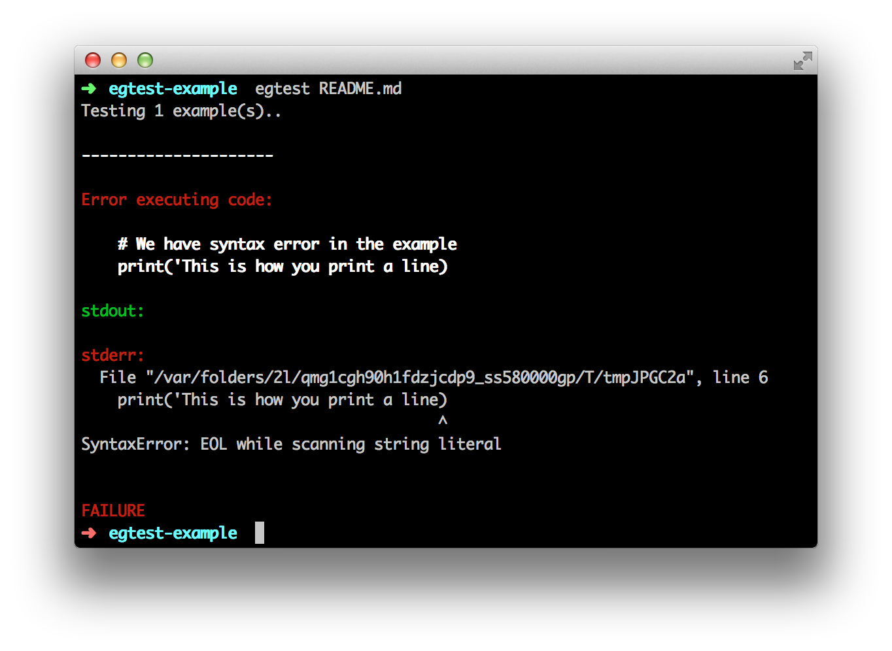

# E.g. test

[](https://travis-ci.org/kimmobrunfeldt/egtest)
[](https://coveralls.io/r/kimmobrunfeldt/egtest?branch=master)
[](https://badge.fury.io/py/egtest.png)
[](https://pypip.in/d/egtest/badge.png)

*E.g. test* parses code blocks from documentation, runs them and reports possible errors. Incorrect example is worse than no example at all.

**Example**

Python code block, which tries to demonstrate printing

```python
# We have syntax error in the example
print('This is how you print a line)
```

Running `egtest README.md` looks like this:



## Install

Python versions 2.6 - 3.3 are supported and tested against.

Install latest release with *pip*:

    pip install egtest

Install latest development version usin *pip*:

    pip install git+git://github.com/kimmobrunfeldt/egtest.git

Install latest development version using *setup.py*:

    git clone git@github.com:kimmobrunfeldt/egtest.git
    cd egtest
    python setup.py install


## Contributing

[Documentation for Egtest developers](docs/)
